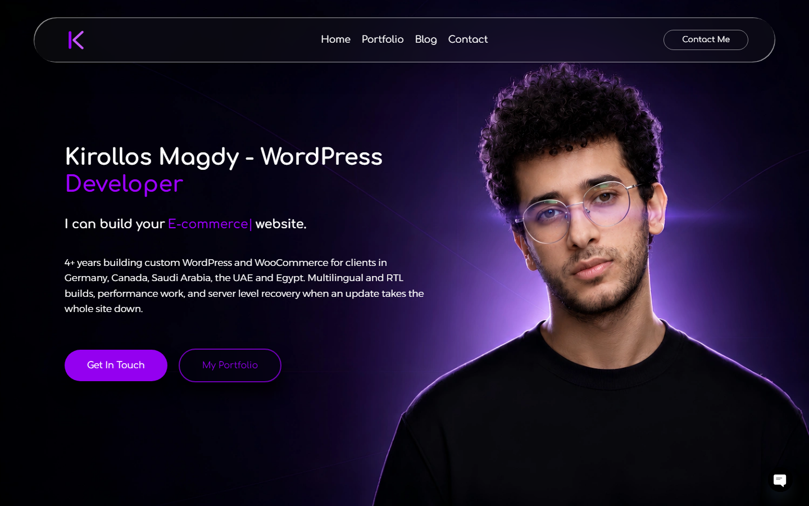
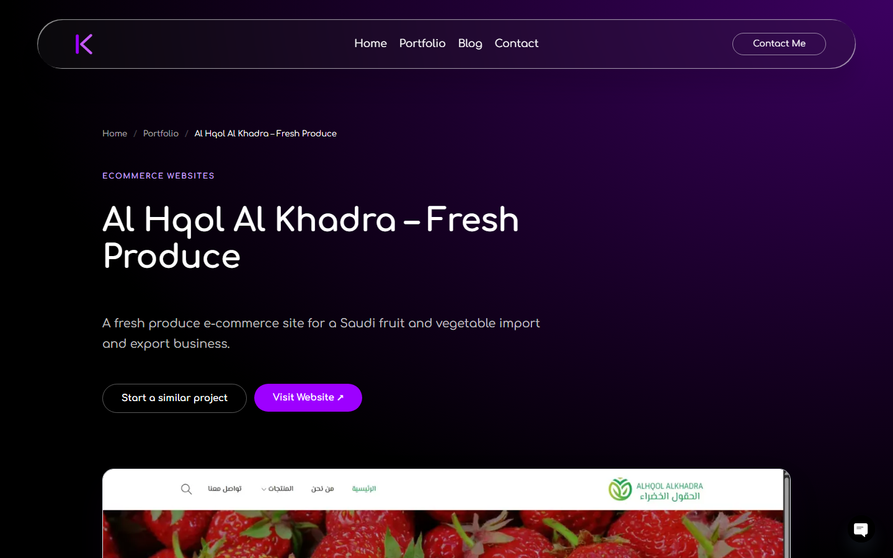
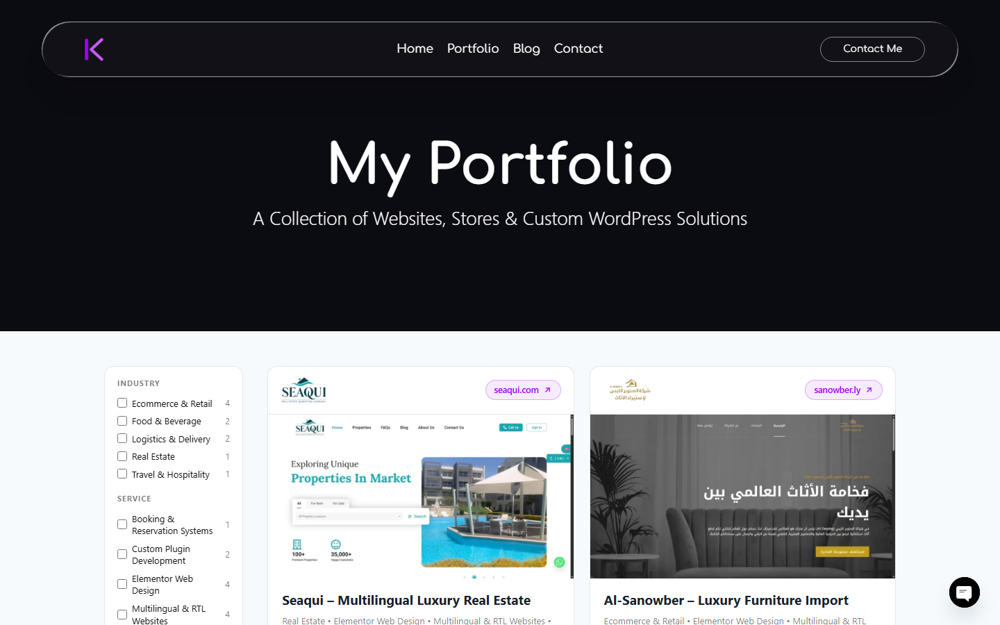

# Kirollos Magdy Portfolio Builder

A WordPress plugin for Elementor that powers my developer portfolio at **[kirollosmagdy.com](https://kirollosmagdy.com)**: a portfolio post type, 14 custom Elementor widgets, interaction effects on every element, an icon library, auto-generated case-study pages and a custom blog article template. It works with the free version of Elementor.




## Features

### Portfolio content
- **Portfolios post type** with Project Categories, Services and Industries taxonomies. It registers only when no theme or plugin already owns the name, so it never fights an existing setup.
- **Project fields** on the edit screen: live website URL, completion month, a gallery of up to four screenshots and a secondary featured image.

### 14 Elementor widgets
| Group | Widgets |
| --- | --- |
| Portfolio | Latest Projects, Portfolio Archive, Portfolio Logo Wall, Portfolio Slider, Portfolio Horizontal Slider, Portfolio Pin Spacer, Portfolio Filter List, Works Slider, Works Tabs Mini |
| Content | Animated Heading, Post Title, Post Image, Dynamic Post Meta |
| Blog | Latest Articles (category navigation and Load more) |

Each widget has full Content and Style controls and loads its CSS and JavaScript only on pages that use it.

### Interaction panels on every element
Added to the **Advanced** tab of every Elementor section, column, container and widget:
- **Mouse Effects:** Mouse Track (Parallax), 3D Tilt with optional glare, Magnetic Pull.
- **Floating Effects:** continuous float, rotate and scale, in pure CSS so it previews live in the editor.
- **Mouse Cursor:** replaces the pointer over an element with a dot or circle, text or an image.
- **Cursor Trail:** Particles, Sparkles, Glow Orb or Comet Tail, drawn on a canvas behind the content.

For visitors who prefer reduced motion, floating and cursor trails switch off and mouse-effect transitions are removed. Custom cursors only run on devices with a precise pointer.

### Case-study page generator
**Portfolios > Elementor Pages** turns each project into a full Elementor case-study page, built from its title, excerpt, content, logo, screenshots, website link, date and terms. The result stays fully editable in Elementor. A hand-made layout is backed up before it is replaced and can be restored with one click. Empty Yoast meta descriptions and image alt text are filled in, never overwritten.



### Blog article template
Single posts get a dark hero, cover image, reading column with a sticky table of contents, reading progress bar, share buttons, author box, related articles and a call to action. Posts built with Elementor are left alone.


### Icon library
A custom icon font registered in Elementor's Icon Library (**Kirollos Portfolio**): build icons (WordPress, Custom Plugin, Custom Theme, WooCommerce, Shopify, Performance) and freelance platform icons (Mostaql, Khamsat, Freelancer, Upwork, Fiverr, Behance).

## Screenshots

| Portfolio archive | Blog with Latest Articles |
| --- | --- |
|  |  |

## Engineering notes

- **Live editing without `data-*` attributes.** Elementor does not re-render `data-*` attributes printed from `before_render` while you edit, so every effect setting reaches the JavaScript as a prefix class or a CSS custom property. Changes show up in the editor instantly.
- **Modular and collision-safe.** Each feature lives in its own module under `modules/`. Modules load on `plugins_loaded`, after every plugin file is included, so an older standalone copy of a module is detected and skipped with an admin notice instead of crashing the site on duplicate names.
- **Safe data migrations.** Elementor stores widget names inside each page's `_elementor_data`. When a widget is renamed, a one-time migration rewrites the stored name and clears Elementor's generated CSS, so existing pages keep working.
- **Cache busting.** Assets are versioned by plugin version or file modification time, so browsers never keep stale CSS or JavaScript after an update.
- **WordPress security practices.** Nonces and capability checks on every form and admin action, sanitized input and escaped output.

## Requirements

- WordPress 6.0 or newer
- PHP 7.4 or newer
- Elementor 3.5 or newer (free) for the widgets and panels. The portfolio post type, case-study builder and blog template work without it.

## Installation

This plugin is not licensed for installation by others. To use it on your own site, [contact me](https://kirollosmagdy.com/contact/) for a license.

## Project structure

```
kirollos-magdy-portfolio-builder/
├── kirollos-magdy-portfolio-builder.php   Bootstrap, module loader, activation hooks
├── includes/                              Effect controls, assets, icons, core widgets, project fields
├── assets/                                Effect CSS/JS, widget styles, icon font
└── modules/
    ├── portfolio-widgets/                 Post type, taxonomies and nine portfolio widgets
    ├── portfolio-pages/                   Case-study page generator
    ├── blog-template/                     Single post template
    └── latest-articles/                   Latest Articles widget
```

## Author

**Kirollos Magdy**, WordPress Developer. I build custom WordPress and WooCommerce websites, Elementor widgets and plugins, multilingual and RTL sites, and performance work for clients in Canada, Germany, the UAE, Saudi Arabia and Egypt.

- Portfolio: [kirollosmagdy.com](https://kirollosmagdy.com)
- Hire me: [kirollosmagdy.com/contact](https://kirollosmagdy.com/contact/)

## License

Copyright (C) 2026 Kirollos Magdy. **All rights reserved.** This code is published for portfolio and code review only. It may not be used, copied, modified, distributed or sold without my written permission. See [LICENSE](LICENSE).

Third-party components keep their own licenses: WOW.js (MIT), and Freelancer, Upwork, Fiverr and Behance icons from Simple Icons (CC0). Brand marks remain the property of their owners.
